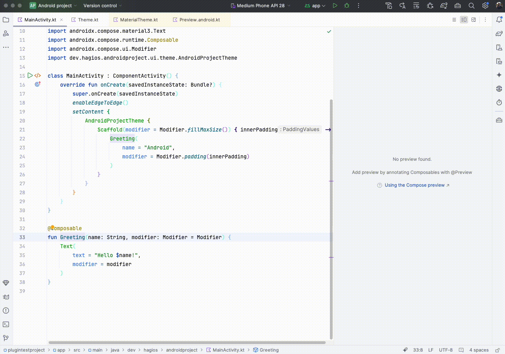

# Jetpack-Compose-preview-creator

<!-- Plugin description -->
Plugin to quickly create previews for composable functions. The plugin takes the function name and arguments and wraps
it into a preview function, which then gets added to the end of the file.
Just use the generate menu (comand + enter) when your cursor is on the name of a composable function and select "
Generate Compose Preview". The preview is added at the end of the file with an suffix you can configure in the settings.

Features:
  <li>Initializes all parameters of the composable(also classes with their constructor call)</li>
  <li>Select a default visibility of the generated preview function</li>
  <li>Choose if parameter names are used in the composable function call</li>
  <li>Choose if the default values of a parameter are used or if the plugin should create values</li>
  <li>Wrap the composable in a theme</li>

<!-- Plugin description end -->

## Installation

- Using the IDE built-in plugin system:
  
  <kbd>Settings/Preferences</kbd> > <kbd>Plugins</kbd> > <kbd>Marketplace</kbd> > <kbd>Search for "Jetpack-Compose-preview-creator"</kbd> >
  <kbd>Install</kbd>
  
- Using JetBrains Marketplace:

  Go to [JetBrains Marketplace](https://plugins.jetbrains.com/plugin/25951-jetpack-compose-preview-creator) and install
  it by clicking the <kbd>Install to ...</kbd> button in case your IDE is running.

  You can also download
  the [latest release](https://plugins.jetbrains.com/plugin/25951-jetpack-compose-preview-creator/versions) from
  JetBrains Marketplace and install it manually using
  <kbd>Settings/Preferences</kbd> > <kbd>Plugins</kbd> > <kbd>⚙️</kbd> > <kbd>Install plugin from disk...</kbd>

- Manually:

  Download the [latest release](https://github.com/EarlOfEgo/Jetpack-Compose-preview-creator/releases/latest) and install it manually using
  <kbd>Settings/Preferences</kbd> > <kbd>Plugins</kbd> > <kbd>⚙️</kbd> > <kbd>Install plugin from disk...</kbd>

---
Plugin based on the [IntelliJ Platform Plugin Template][template].

[template]: https://github.com/JetBrains/intellij-platform-plugin-template
[docs:plugin-description]: https://plugins.jetbrains.com/docs/intellij/plugin-user-experience.html#plugin-description-and-presentation
